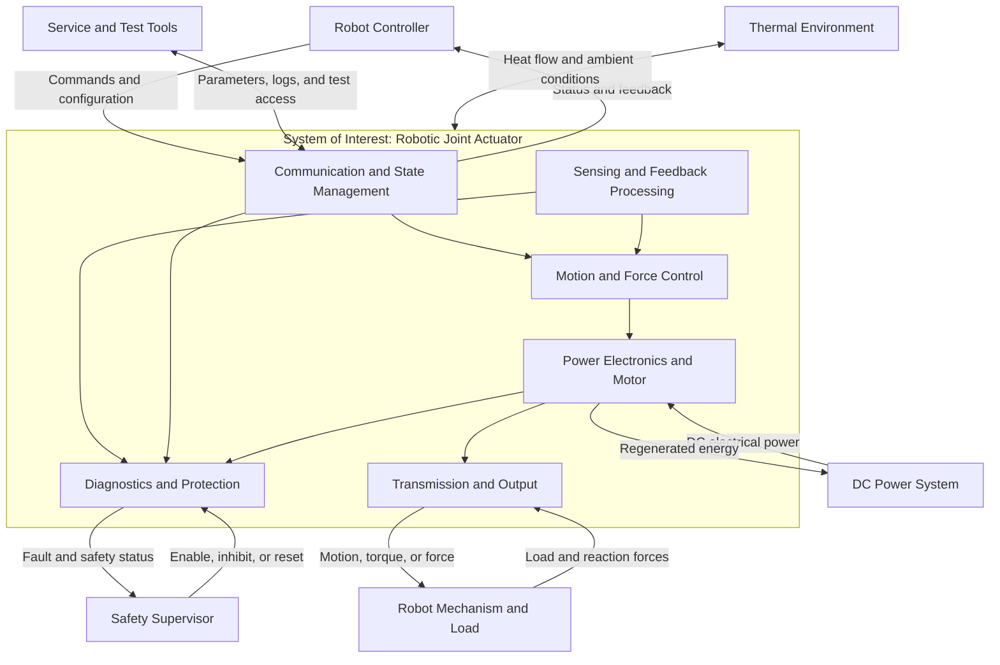

# Robotic Joint Actuator System Boundary

## 1. Purpose

This document defines the system boundary of a generic robotic joint actuator.

A clear system boundary establishes:

* What is included in the joint actuator system
* What remains the responsibility of the robot-level system
* Which physical and logical interfaces cross the boundary
* How responsibilities are allocated across those interfaces
* Where component-level verification ends and system-level validation begins

The boundary definition is intentionally architecture-oriented rather than product-specific. It provides a reusable reference model for rotary actuators, linear actuators, and other integrated electromechanical joint solutions.

No company-specific architecture, product parameter, proprietary protocol, production data, or customer information is represented.

---

## 2. System of Interest

The **System of Interest (SoI)** is the robotic joint actuator as an integrated electromechanical subsystem.

Its primary purpose is to convert electrical power and digital commands into controlled mechanical motion or force while providing feedback, diagnostics, and protective reactions.

For this reference model, the joint actuator may contain:

* Communication and command handling
* Operating-mode and state management
* Embedded motion or force control
* Position, velocity, current, torque, force, and temperature sensing
* Signal conditioning and feedback processing
* Power electronics and motor-current control
* Electric motor or equivalent electromagnetic actuator
* Mechanical transmission
* Output position or force interface
* Local diagnostics and fault management
* Local electrical, thermal, and motion protection
* Optional holding brake
* Optional local cooling devices
* Bootloader, parameter storage, and service functions

The exact physical integration may vary. For example, the controller, power stage, motor, transmission, and sensors may be packaged in one assembly or distributed across several connected modules. The functional boundary remains valid as long as responsibility for each function is explicitly allocated.

---

## 3. System Context

The joint actuator interacts with several external systems:

* A robot controller provides commands and coordination
* A DC power system provides electrical energy and absorbs or manages regenerated energy
* The robot mechanism and external load receive mechanical motion or force
* A safety supervisor coordinates system-level enabling and fault reactions
* The thermal environment removes heat from the actuator
* Service and test tools support configuration, diagnostics, calibration, and verification

The diagram represents a functional context, not a mandatory physical layout. Some functions may be combined, separated, or omitted depending on the application.

---

## 4. Boundary Definition

### 4.1 Inside the System Boundary

The reference system boundary includes the functions required to produce controlled actuator output from received commands and supplied electrical power.

| Functional area           | Included responsibility                                                                          |
| ------------------------- | ------------------------------------------------------------------------------------------------ |
| Command handling          | Receive, decode, validate, and apply actuator commands                                           |
| State management          | Manage initialization, disabled, enabled, degraded, fault, and service states                    |
| Control                   | Execute local current, velocity, position, impedance, torque, or force control as allocated      |
| Feedback processing       | Acquire sensor signals, perform plausibility checks, and generate usable feedback variables      |
| Power conversion          | Convert DC input power into controlled motor phase currents                                      |
| Electromagnetic actuation | Convert electrical energy into motor torque or linear force                                      |
| Mechanical transmission   | Transfer motor output to the actuator output interface                                           |
| Local protection          | Detect and react to actuator-level electrical, thermal, sensor, communication, and motion faults |
| Diagnostics               | Report status, measurements, fault information, and relevant operating data                      |
| Parameter management      | Store and apply actuator-level configuration and calibration data                                |
| Local maintenance support | Support approved firmware, calibration, diagnostic, and test operations                          |

### 4.2 Outside the System Boundary

The following functions are outside the reference actuator boundary unless explicitly reassigned by a particular architecture:

* Whole-body motion planning
* Robot trajectory generation
* Coordination among multiple joints
* Robot-level balance and stability control
* Robot task planning and perception
* Battery management
* DC-bus energy storage and system-level power distribution
* Robot-level pre-charge and main power isolation
* System-level management of regenerated energy
* Structural design of robot links
* External payload and environmental load definition
* Centralized thermal-management equipment
* System-level functional-safety concept
* Emergency-stop architecture
* External communication infrastructure
* Manufacturing-line systems
* Fleet, cloud, or remote-operation services

External systems may depend on actuator data or reactions, but this dependency does not automatically move those systems inside the actuator boundary.

---

## 5. Boundary Interfaces

### 5.1 Interface Overview

| Interface ID | Interface                     | External system                   | Information or energy crossing the boundary                                                              |
| ------------ | ----------------------------- | --------------------------------- | -------------------------------------------------------------------------------------------------------- |
| IF-CMD       | Command interface             | Robot controller                  | Control mode, target values, gains, limits, timing information, and enable requests                      |
| IF-STS       | Status interface              | Robot controller                  | Position, velocity, torque or force estimate, operating state, diagnostic status, and timing information |
| IF-PWR       | Electrical power interface    | DC power system                   | Supply voltage, input current, transient energy, and regenerated energy                                  |
| IF-MECH      | Mechanical interface          | Robot mechanism                   | Output motion, torque or force, reaction load, vibration, and mechanical constraints                     |
| IF-SAFE      | Safety coordination interface | Safety supervisor                 | Enable, inhibit, reset, health status, and fault-reaction coordination                                   |
| IF-THERM     | Thermal interface             | Robot structure or cooling system | Generated heat, surface temperature, coolant or airflow conditions, and ambient temperature              |
| IF-SVC       | Service interface             | Service and test tools            | Firmware, configuration, calibration commands, diagnostic data, and test results                         |

A single physical connector or network may carry several logical interfaces. Separating the interfaces logically makes responsibility allocation and verification clearer.

### 5.2 Command and Communication Interface

The robot controller is responsible for:

* Generating valid motion or force targets
* Coordinating commands across multiple actuators
* Maintaining the required communication schedule
* Respecting the actuator’s declared operating envelope
* Selecting an appropriate robot-level response to actuator faults

The joint actuator is responsible for:

* Validating command format and range
* Checking command freshness and sequence where required
* Applying commands only in compatible operating states
* Detecting missing, delayed, inconsistent, or implausible commands
* Reporting whether a command was accepted, limited, rejected, or interrupted
* Entering a defined local reaction when communication becomes invalid

This document does not prescribe a specific communication protocol, network topology, update rate, or data format.

### 5.3 Electrical Power Interface

The external DC power system is responsible for:

* Providing power within an agreed operating range
* Defining available continuous and transient power
* Providing system-level isolation and protection
* Managing shared-bus behavior
* Providing a valid destination for regenerated energy or defining how it must be limited

The actuator is responsible for:

* Operating within its declared electrical envelope
* Controlling its internal power stage
* Monitoring relevant voltage and current conditions
* Limiting or disabling operation when local electrical limits are exceeded
* Reporting electrical faults and derating states
* Preventing uncontrolled actuator output following detectable local failures

Responsibility for inrush-current control, pre-charge, discharge, and regenerative-energy limitation must be explicitly allocated during robot architecture design. These functions should not be assumed to belong to either side of the interface without a documented decision.

### 5.4 Mechanical Interface

The mechanical boundary includes both:

* The actuator output interface connected to the driven robot link
* The actuator reaction interface connected to the supporting structure

The actuator is responsible for:

* Producing controlled output within its declared capability
* Providing defined mechanical mounting and output interfaces
* Declaring allowable axial, radial, torsional, shock, and vibration loads
* Declaring backlash, compliance, friction, and transmission limitations where relevant
* Detecting locally observable mechanical abnormalities when such detection is implemented

The robot mechanism is responsible for:

* Maintaining loads within the actuator’s qualified operating envelope
* Providing appropriate alignment, support, and fastening
* Preventing external hard stops from creating unacceptable actuator loads
* Accounting for structural compliance and load paths
* Defining payload, collision, impact, and environmental load cases

The actuator boundary does not include the complete robot-link structure or external payload.

### 5.5 Thermal Interface

The actuator generates heat through electrical losses, motor losses, bearing friction, transmission losses, and control electronics.

The actuator is responsible for:

* Monitoring locally available temperature signals
* Applying local derating or shutdown reactions where allocated
* Reporting thermal status
* Declaring the thermal conditions required to meet its performance envelope

The robot-level thermal system is responsible for:

* Providing the specified ambient, airflow, conduction, or coolant conditions
* Preventing heat accumulation caused by neighboring components
* Coordinating system-level derating when several heat sources interact

If a fan, pump, heat exchanger, or coolant path is physically integrated into the actuator, its local control may be inside the actuator boundary. The external heat sink and final heat rejection to the environment remain system-level concerns.

### 5.6 Safety Coordination Interface

The actuator may implement local protective mechanisms, but the actuator alone does not define the safety of the complete robot.

Typical actuator-level responsibilities include:

* Detecting local sensor, power-stage, communication, temperature, and control faults
* Limiting or disabling output after a defined fault
* Reporting the reason for a protective reaction
* Maintaining a defined state after power interruption or reset
* Supporting an externally requested inhibit function where allocated

Robot-level responsibilities include:

* Hazard analysis and risk assessment
* Emergency-stop behavior
* Coordination of multiple actuators
* Management of gravity, stored energy, and falling hazards
* Selection of a system-level safe state
* Validation of the complete safety function

A locally disabled motor does not necessarily place the robot in a safe state. Gravity, elastic elements, mechanical backdriving, brakes, and external loads must also be considered.

### 5.7 Service and Maintenance Interface

The service interface may support:

* Firmware installation
* Parameter configuration
* Sensor calibration
* Diagnostic readout
* Fault-history retrieval
* Manufacturing or maintenance tests
* Controlled engineering-mode operation

Service functions must be separated from normal control functions. Access control, configuration integrity, version compatibility, rollback behavior, and recovery from interrupted updates must be addressed by the implementation architecture.

---

## 6. Responsibility Allocation

Boundary-related failures often occur when two subsystems each assume that the other owns a function. The following allocations should therefore be resolved explicitly.

| Engineering question                         | Actuator-level responsibility                                       | Robot-level responsibility                           | Shared decision required                 |
| -------------------------------------------- | ------------------------------------------------------------------- | ---------------------------------------------------- | ---------------------------------------- |
| Who generates the motion trajectory?         | Execute accepted local targets                                      | Generate and coordinate trajectories                 | Define command semantics                 |
| Who enforces actuator limits?                | Apply local hard protection and configured limits                   | Avoid commanding operation outside the envelope      | Define limit hierarchy                   |
| Who handles communication loss?              | Detect loss and perform the assigned local reaction                 | Coordinate the remaining robot and recovery sequence | Define timeout and reaction strategy     |
| Who manages regenerative energy?             | Report or locally limit regeneration as allocated                   | Absorb, redistribute, or dissipate bus energy        | Define worst-case energy flow            |
| Who controls thermal derating?               | Protect local components                                            | Coordinate robot performance                         | Define derating authority                |
| Who establishes the absolute joint position? | Provide available sensor information and local initialization logic | Resolve robot-level pose consistency                 | Define startup and recovery process      |
| Who performs emergency stopping?             | Execute allocated local inhibit or braking action                   | Coordinate the complete safety function              | Define safe-state behavior               |
| Who owns calibration data?                   | Store and apply actuator-level coefficients                         | Maintain robot-level kinematic calibration           | Define configuration and version control |

Any unresolved shared decision should be recorded as an architecture issue rather than hidden inside an interface assumption.

---

## 7. Operating Scenarios Crossing the Boundary

The boundary must remain valid across the complete actuator lifecycle, not only during normal motion.

Important scenarios include:

1. **Power application and initialization**
   The power system energizes the actuator, sensors become available, configuration is checked, and the actuator determines whether controlled operation may begin.

2. **Normal enabled operation**
   The robot controller sends commands, the actuator produces mechanical output, and feedback is returned within the defined timing and accuracy envelope.

3. **Command interruption**
   Commands become late, missing, invalid, or inconsistent. The actuator detects the condition and performs the allocated reaction.

4. **Regenerative operation**
   Mechanical energy flows from the robot mechanism through the actuator to the electrical bus. The actuator and power system must remain within their jointly defined limits.

5. **Thermal derating**
   The actuator approaches a thermal limit and reduces available performance while communicating the degraded capability to the robot controller.

6. **Fault reaction**
   A local fault is detected. The actuator limits or disables output and reports sufficient information for system-level coordination.

7. **Power loss or reset**
   Electrical power or communication is interrupted. The robot architecture must account for loss of active torque, brake behavior, gravity, stored mechanical energy, and position recovery.

8. **Service operation**
   Firmware, parameters, or calibration data are accessed under controlled conditions without unintentionally enabling normal mechanical output.

These scenarios should later be linked to detailed requirements and verification cases.

---

## 8. Assumptions

This reference boundary is based on the following assumptions:

* The actuator is part of a multi-axis robotic system.
* A higher-level controller coordinates the robot’s overall behavior.
* Electrical power is supplied through a shared or dedicated DC source.
* The actuator contains enough local control capability to regulate its assigned output variable.
* Mechanical output may be rotary or linear.
* Feedback sensors may be integrated or connected as actuator-level devices.
* Communication, electrical power, and mechanical loads may fail independently.
* The actuator may exchange energy bidirectionally with the power system.
* Local protection does not replace system-level risk reduction.
* Exact performance values and fault-reaction times are defined by application-specific requirements, not by this reference model.

If one of these assumptions is not valid, the boundary and responsibility allocation must be tailored before requirements are derived.

---

## 9. Boundary Verification Strategy

Verification should demonstrate both correct actuator behavior and correct interaction across every boundary interface.

| Verification area   | Typical method                                                             | Primary boundary question                                                                        |
| ------------------- | -------------------------------------------------------------------------- | ------------------------------------------------------------------------------------------------ |
| Command handling    | Software test, network simulation, or hardware-in-the-loop test            | Does the actuator accept valid commands and reject invalid ones correctly?                       |
| Feedback and timing | Logging, timestamp analysis, and reference measurement                     | Is feedback accurate, coherent, and delivered within the required timing envelope?               |
| Electrical behavior | Power-source and load testing                                              | Does the actuator remain within electrical limits during motoring, transients, and regeneration? |
| Mechanical output   | Dynamometer, torque fixture, force fixture, or external motion measurement | Does the output match the commanded behavior under representative loads?                         |
| Thermal behavior    | Thermal chamber, controlled cooling, and endurance testing                 | Are temperature estimates, derating, and shutdown reactions effective?                           |
| Fault management    | Fault injection and boundary-condition testing                             | Are faults detected, reported, and handled according to the allocated responsibility?            |
| Communication loss  | Packet delay, dropout, corruption, and disconnection testing               | Is the local reaction deterministic and compatible with robot-level recovery?                    |
| Power interruption  | Controlled brownout, shutdown, and restart testing                         | Does the actuator return to a defined state without unintended output?                           |
| Service functions   | Update, rollback, calibration, and access-control testing                  | Can maintenance operations be completed without compromising normal control?                     |
| System integration  | Multi-axis robot test                                                      | Do actuator-level reactions produce acceptable robot-level behavior?                             |

Actuator-level testing can verify local behavior, but it cannot fully validate:

* Whole-robot stability
* Multi-axis coordination
* Falling or tipping hazards
* System-level emergency stopping
* Shared-bus regenerative behavior
* Interactions among multiple thermal sources
* Final functional-safety performance

Those topics require robot-level integration and validation.

---

## 10. Boundary Review Checklist

Before approving a joint actuator architecture, confirm that:

* [ ] Every required function has a named owner.
* [ ] No function is implicitly assumed to exist on both sides of an interface.
* [ ] Command and feedback semantics are defined.
* [ ] Communication timing and loss behavior are allocated.
* [ ] Electrical operating and transient limits are defined.
* [ ] Regenerated-energy management has a defined owner.
* [ ] Mechanical load cases and mounting responsibilities are defined.
* [ ] Thermal conditions and derating authority are defined.
* [ ] Initialization and position-recovery responsibilities are defined.
* [ ] Local protective reactions are compatible with robot-level behavior.
* [ ] Service functions cannot unintentionally create mechanical output.
* [ ] Verification exists for normal, degraded, fault, and recovery scenarios.
* [ ] Actuator-level verification is clearly separated from robot-level validation.
* [ ] Architecture assumptions and unresolved decisions are recorded.

---

## 11. Out of Scope

This document does not define:

* Detailed control algorithms
* Control-loop parameter values
* A specific communication protocol
* Network message layouts
* Electrical ratings
* Mechanical dimensions
* Component selection
* Diagnostic trouble-code definitions
* Safety integrity levels
* Production test limits
* Product-specific acceptance criteria

These topics should be developed in dedicated control, communication, diagnostics, safety, and verification documents after the system boundary has been agreed.

---

## 12. Limitations and Tailoring

A system boundary is an engineering decision, not a universal physical fact.

Different robotic architectures may allocate the same function differently. For example:

* Current control may be located inside an integrated actuator or in a remote drive.
* Position initialization may be performed locally or coordinated by the robot controller.
* A brake may be part of the actuator, part of the joint mechanism, or absent.
* Cooling hardware may be integrated or provided by the robot.
* Power pre-charge may be centralized or distributed.
* Safety inhibition may be implemented through communication, dedicated hardware, or both.

The important engineering objective is not to force every architecture into one pattern. It is to make each responsibility visible, testable, and traceable.

---

## 13. Public-Portfolio Disclosure

This document presents an independently developed, generic engineering reference model for educational and professional-portfolio purposes.

All diagrams and descriptions are original abstractions. Values, product identifiers, internal project names, customer information, proprietary software, internal protocols, production data, and confidential design details are intentionally excluded.
